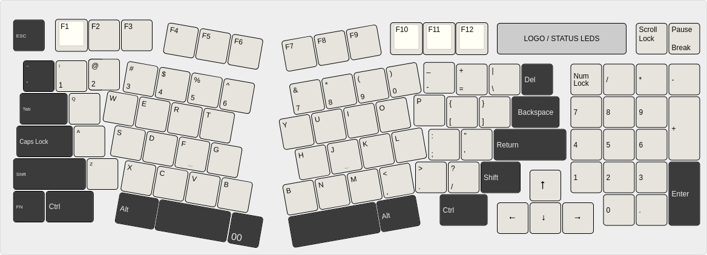

# Note 2

## Regards to the keyboard

After some thinking I think that a traditionaly laid out keyboard would be best. While I would like a detechable ergonomic keyboard I do not think it makes sense for the device to close. I might be able to get around this by having a keyboard pop in and out of place, but that introduces moving parts into the equasion, plus the keyboard is the same board I want the MU to be mounted to (the underside). Soooo ultimately its not super in the cards... but maybe in the future.

Think the lenovo butterfly keyboard but ergonomic....

anyways I think ill stick with a (atmittedly large) Alice layout combined with a 1800 style keyboard. Here is a picture of what I am thinking

[source](https://geekhack.org/index.php?topic=106373.0)

I will have to figure out PCB sizes and things later, I just wanted to make sure these were *"bookmarked"*

[here](https://www.reddit.com/r/ErgoMechKeyboards/comments/1huhzf9/molekula_keyboard_framework/) is another interesting keyboard design that I might look into using... at some point. NOT FOR THIS PROJECT

MORE KEYBOARDS: 
https://imgur.com/a/jabberwocky-prototype-diagrams-FmBDwlt
https://www.reddit.com/r/CustomKeyboards/comments/y3v8vx/jabberwocky_cnc_prototype/#lightbox
https://geekhack.org/index.php?topic=107023.0

https://github.com/AcheronProject/Sagittarius/tree/master/graphics/layout
