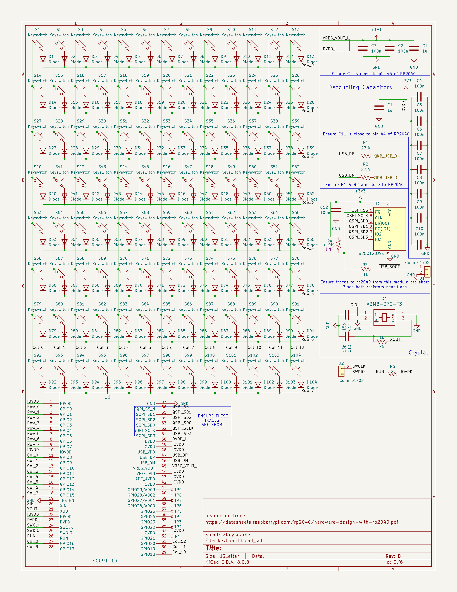

# Midterm Review

As you can see I have been hard at work planning out my project and purchasing parts for the final project.
I have chosen the Latte panda MU 

The majority of the work so far has gone into planning, outlining and hardware decisions. 
Currently I am confident that my chosen hardware will not change going forward, additionally I have confirmed interoperability of the screen directly with the Compute Module (MU-CM).
I have attached a screenshot of the current schematic for the keyboard. It is using the RPI2040 as the main usb interface between the MU-CM and the keyswitches.

Additionally I have done some work on battery management and understanding how a BMS needs to be integrated into a system like this. 
I have opted to go for a 4s2p configuration as it will allow for nominal operational voltages, and will easily meet the required current capacity.
The current capacity has been determined by real life load testing in dearborn 211 where I preformed a load analysis running the existing test bench system at full capacity.
you can see more notes about my thoughts [here](./General_Notes/note3.md)

Additionally the layout for the keyboard has been decided as the acheron projects sagittarius layout, with the addition of a numpad, function row, and mouse buttons. 
